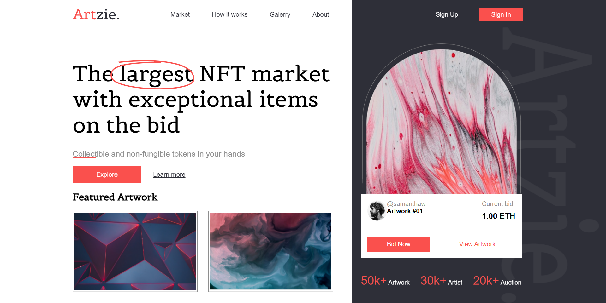

# Bienvenido a mi página web! 👋

Mi nombre es Brais Márquez y este es el repositorio del encabezado de una página web ficticia basada en un mercado de

## Descripción 📝
Esta página web está diseñada para pantallas con un ancho de 1200px. Incluye elementos como el logotipo de la marca, el menú de navegación, opciones de acceso y registro, y otras funcionalidades importantes para la navegación y la interacción con el sitio.

## Vista previa

## Comunidad 👥
Si encuentras algún problema o tienes alguna sugerencia de mejora, ¡no dudes en mencionarlo para darle solución e implementarlo! 

## Trabajo Freelance 👨🏻‍💻
Estoy disponible para trabajar en proyectos de diseño web, ya sea para particulares o empresas. Si necesitas ayuda con el diseño de tu sitio web o tienes algún proyecto en mente, ¡no dudes en contactarme en

